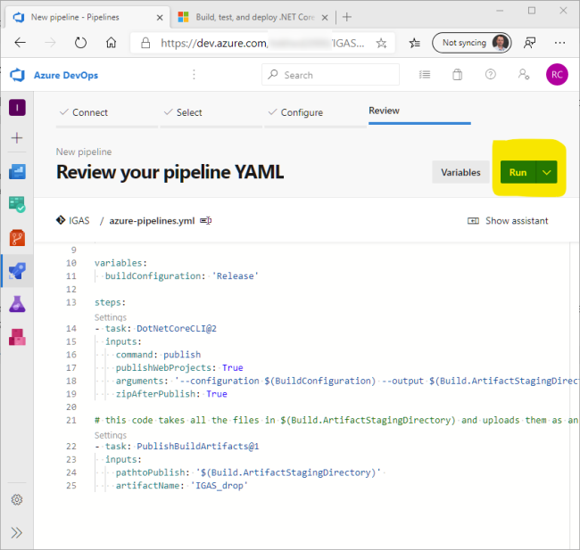
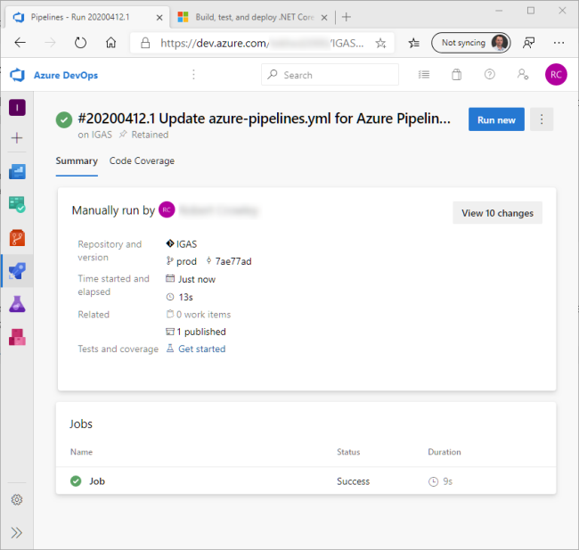
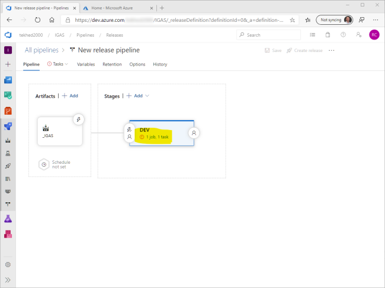

# Exercise #2, Rub DevOps On It (30 min.)
Now that you have completed development of the API, it is time to #RubDevOpsOnIt.
Make sure you have completed the prerequisites so you have an Azure DevOps organization ready to go, log into your DevOps account, then:

1. Create project
    * Name the project whatever you want.
    * Choose between public and private. It may be easier to receive assistance if you make it public. 
    * Click "Create project" to generate a project backed by a Git repository.
1. Once the project has been created, choose "Repos" to get your source code into Azure Git.
1. Choose "Import a repository option".
1. For the clone URL, enter https://github.com/crowcoder/IGAS_Workshop.git
1. When the import is complete you will see your new repository. This repo is a copy of the GitHub repo, the two are not linked. Changes to one will not affect changes to the other.
1. Change to the Prod branch.

 | Step 1 | Step 2 | Step 3 | 
 | --- | --- | --- |
 |  |  |  |
 | **Step 4** | **Step 5** | **Step 6**| 
 |  |  |  |

## Prod branch differences
 In just a moment you will create a Build of the project in Azure DevOps. But first, let's go over what I have changed between what you have done so far on the master branch and Prod branch which we will be working with from here on out. You can view the files in the DevOps user interface or in your IDE by changing to the Prod branch.

 #### Changes to Program.cs
In the setup of the Environment Variable configuration provider I have included a prefix argument of "IGAS_". This means that only environment variables that begin with "IGAS_" will be pulled into configuration. Note that the prefix itself will be removed. If you have an environment variable named "IGAS_Password" then your C# code will need to look for just "Password".

```CSharp
 config.AddEnvironmentVariables(prefix: "IGAS_");
```
 #### Changes to ConfigurationController.cs
The `Get()` method has been modified to return all configuration settings instead of writing a line of code for each one (e.g. `_config.GetValue<string>("..setting..")`). This will allow us to focus on how and where to set configuration without needing to make a bunch of code edits. It also facilitates experimentation because any changes you make, regardless of the technique, will echo back from your API call.
 ```CSharp
var AllConfigSettings = _config.AsEnumerable()
    .Select(c => new { ConfigKey = c.Key, ConfigValue = c.Value});

return AllConfigSettings;
```
#### Changes to appsettings.json
The appsettings file has been modified to include a few fictitious settings. The values are formatted as "\_\_*value*\_\_". The double underscores are meant to make the value a "token" that can be replaced during deployment.
```JSON
{
    "ConnectionString" : "__ConnectionString__",
    "StockQuoteAPIURL" : "__StockQuoteAPIURL__",
    "Password" : "__Password__"
}
```
<a id="setupabuild"></a>
 ## Setup a Build
 We don't have a lot of work to do in the Build pipeline. There are no configuration steps included here (though you could), we just need to have a published project to deploy in the Release pipeline. It is in the Release Pipeline that we will manage configuration.
 > [More information on Build pipelines](https://docs.microsoft.com/en-us/azure/devops/pipelines/ecosystems/dotnet-core?view=azure-devops#package-and-deliver-your-code)

1. Click on the Rocket Ship icon to open Pipelines and then click "Create Pipeline"
1. Choose Azure Repos Git YAML
1. Select the IGAS Git code repository
1. (this step may not be necessary, your .yml file may be chosen automatically) Select Existing Azure Pipelines YAML file. 
1. (this step may not be necessary, your .yml file may be chosen automatically) Select the "prod" branch and "azure-pipelines.yml" file.
1. Click run to build the project and produce an artifact that will be deployed later in a Release pipeline.
1. Review the successful deployment.

  | Step 1 | Step 2 | Step 3 | 
 | --- | --- | --- |
 |  |  |  |
 | **Step 4** | **Step 5** | **Step 6**| 
 |  |  |  |
  | **Step 7** |  | | 
 |  | | |

  ## Create a Release
  A "Release" is the process that deploys your application. It will pick up the artifact created by the Build pipeline and push it to an Azure App Service. Here we also have an opportunity to further configure the application by replacing setting values based on the environment or "stage". For instance, a Release pipeline may have, for example, 3 stages. Development, QA and Production. At each stage we can swap out values that are specific to that stage.

  First things first though, we need an Azure App Service.

  #### Create the App Service
  An Azure App Service is a resource that hosts your web application. The App Service runs within an App Service Plan that provides the cpu, memory and other features. Later, we will experiment with Slots, which requires a paid version of the App Service Plan. So be sure to delete the resources you create when you are done with the workshop.

> [The Powershell for Azure command reference](https://docs.microsoft.com/en-us/powershell/module/?view=azps-3.7.0)

> [workshop.ps1 in the scripts folder has all the commands you will see here, in an easier to execute format](../scripts/workshop.ps1)

You will execute the following Powershell commands to create a Resource Group, an Azure App Service Plan, and a Web App, **but edits are required.**
1. [Optional] If your default subscription is not the one you want to use for this workshop, uncomment **line 10** and enter the Azure Subscription ID you want to use.
1. [Optional] On **line 15** change the location to a region closest to you.
1. On **line 24** enter a value to be used as a prefix to the web app name. This must be unique across Azure. Your site will be accessed at "https://~your prefix~-igas-01.azurewebsites.net". Feel free to completely change this name as desired.

```PowerShell
# Authenticate to Azure
Connect-AzAccount

# List the subscriptions your account has access to
Get-AzSubscription

# You may have multiple subscriptions. If the one you want to use for this tutorial
# is not your default subscription, you can do this to change what subscription
# this script will operate against.
# Set-AzContext -SubscriptionId "<enter your subscription id>"

# Create resource group to hold all resources for the tutorial.
# Change the region as appropriate for your location
$groupName = "rg-igas-01"
$location = "eastus"
New-AzResourceGroup -Name $groupName -Location $location

# Create an app service plan
$plan = New-AzAppServicePlan -Location $location  -Name "asp-igas-01" -ResourceGroupName $groupName -Tier "S1"

# Create the App Service to host the application
# The name has to be unique across all of Azure because it is part of the public URL.
# Set the prefix variable to something unique, either completely random or meaningful, doesn't matter.
$prefix = "???"
$app = New-AzWebApp -ResourceGroupName $groupName -Name "$prefix-igas-01" -Location $location -AppServicePlan $plan.Id

# Browse to the URL of the new application to make sure the app service is up.
$newurl = "https://$prefix-igas-01.azurewebsites.net"
[System.Diagnostics.Process]::Start($newurl)
```
> Feel free to check out the App Service in Azure. It should look something like this:


#### Create a Release Pipeline
Now that you have a place to deploy your application, it is time to create a Release Pipeline to push the application up to azure.

1. In DevOps, hover over the rocket and select Releases. If you have not run any releases yet click on "New Pipeline". If you have run any other releases then click [the +New button and select "New Release Pipeline"](./img/new_release_pipeline.png).
1. On the Select a Template screen, Apply the Azure App Service deployment template. This template is pre-configured for deploying to an Azure App Service. 
1. Next, Add an Artifact. An Artifact is the set of files that will be deployed. It is generated by the Build pipeline from [Setup a Build](#setupabuild). The files are stored for us in the Azure cloud. Rename the Stage to "DEV". We will be adding another stage in this workshop named "PROD".
1. Fill out the "Add an artifact" form. Select the workshop project which is named "IGAS" if you chose the suggested project name. The Source (build pipeline) should have the Build we created available in the drop down list. It will also be named "IGAS". In Default Version, choose "Latest" to instruct the release pipeline to always grab the most recent build artifact. Leave Source Alias at its default value and click "Add".
1. click "1 job, 1 task" to open the editor for the tasks in this stage of the release.
1. Choose your Azure Subscription and click Authorize.
1. Once the pipeline is authorized, you can choose the App Service from the drop down list.
1. Save
1. This is asking you to create or choose a folder to save the pipeline in. For simplicity you can just accept the default root folder. 
1. Now that the pipeline is fully defined you can "Create a Release". This will run the pipeline as it exists at this time. You can re-execute a release at any time but it will be configured as it was at the time of creation. Any pipeline changes do not affect already executed releases, though you can edit a previous release and execute it if necessary.
1. Now, execute a release. Click "Create".
1. Click "Release-1" to go to the release instance you just created. As you create future releases they will become Release-2, Release-3, etc.
1. The default release properties have it set to deploy automatically so you should see that it is running. You can configure it to only deploy manually if you prefer.
1. When it is done you should see a Succeeded confirmation.
1. Test the application to ensure it works. Make a GET request to the URL of your app service. Other than the random host name, it will be like this: https://aqixjv2y-igas-01.azurewebsites.net/Configuration/all . I have chosen to use Postman as my HTTP client. Notice there is not much configuration detail returned. Let's change that in [exercise 3](exercise_3.md).


  | Step 1 | Step 2 | Step 3 | 
 | --- | --- | --- |
 |  |  |  |
 | **Step 4** | **Step 5** | **Step 6**| 
 |  |  |  |
  | **Step 7** | **Step 8** | **Step 9** | 
 |  |  |  |
 | **Step 10** | **Step 11** | **Step 12** | 
 |  |  |  |
 | **Step 13** | **Step 14** | **Step 15**  | 
 |  |  |  |