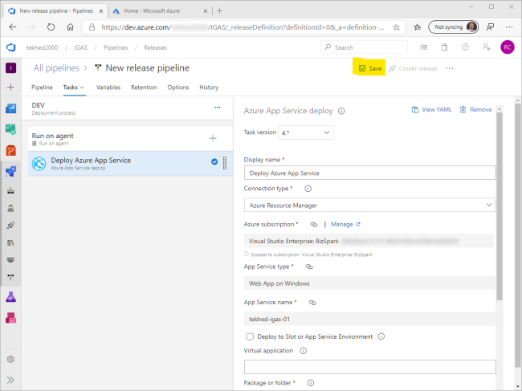

# Exercise #2, Rub DevOps On It (30 min.)
Now that you have completed development of the API, it is time to #RubDevOpsOnIt.
Make sure you have completed the prerequisites so you have an Azure DevOps organization ready to go, log into your DevOps account, then:


Create project
 * Name the project "IGAS" or whatever you like.
 * Choose between public and private. It may be easier to receive assistance if you make it public. 
 * Click "Create project" to generate a project backed by a Git repository.


Once the project has been created, choose "Repos" to get your source code into Azure Git.


Choose "Import a repository option".


For the clone URL, enter https://github.com/crowcoder/IGAS_Prod.git

> IMPORTANT: this is not the same repository that you cloned and worked with in exercise 1!


When the import is complete you will see your new repository. This repo is a copy of the GitHub repo, the two are not linked. Changes to one will not affect changes to the other.


## Prod branch differences
 In just a moment you will create a Build of the project in Azure DevOps. But first, let's go over what I have changed between what you have done so far on the local master branch and the new repository's Prod branch which we will be working with from here on out. 

 #### Changes to Program.cs

```CSharp
  //Tweaking configuration
  AddProdSettingsAndPrefixEnvVars(builder).Build().Run();
```

 I have reverted the code back to using the default host builder, except I have injected two things. 

 First, another json file is added. We will see this again in exercise 5. For now you can basically ignore it.

 Next, in the setup of the Environment Variable configuration provider I have included a prefix argument of "IGAS_". This means that only environment variables that begin with "IGAS_" will be pulled into configuration. Note that the prefix itself will be removed. If you have an environment variable named "IGAS_Password" then your C# code will need to look for just "Password". I have done this simply to remove "noise" from our request results. Seeing every environment variable echoed back would be overwhelming.

 #### Changes to ConfigurationController.cs
The `Get()` method has been modified to return all configuration settings instead of writing a line of code for each one (e.g. `_config.GetValue<string>("..setting..")`). This will allow us to focus on how and where to set configuration without needing to make a bunch of code edits. It also facilitates experimentation because any changes you make, regardless of the technique, will echo back from your API call.
 ```CSharp
var AllConfigSettings = _config.AsEnumerable()
    .Select(c => new { ConfigKey = c.Key, ConfigValue = c.Value});

return AllConfigSettings;
```
Additionally, another action has been added that will also return all configuration items, except it will group and display them by provider. Normally you do not care what provider a setting comes from but this information is helpful for demonstration purposes. It gives visibility into how you can provide a setting from one provider at debug time and another in production. You access this action by adding "/all" to your request URL.

````CSharp
  [HttpGet]
  [Route("all")]
  public IEnumerable<ProviderViewModel> GetAll()
  //...
````
#### Changes to appsettings.json
The appsettings file has been modified to include a few fictitious settings. The values are blank because they will be filled in by the Azure DevOps Release pipeline. 
```JSON
{
    "ConnectionString" : "",
    "StockQuoteAPIURL" : "",
    "Password" : ""
}
```
<a id="setupabuild"></a>
 ## Setup a Build
 We don't have a lot of work to do in the Build pipeline. There are no configuration steps included here (though you could), we just need to have a published project to deploy in the Release pipeline. It is in the Release Pipeline that we will manage most configuration. In exercise 5 we will revisit this build when we work with Secure Files.
 > [More information on Build pipelines](https://docs.microsoft.com/en-us/azure/devops/pipelines/ecosystems/dotnet-core?view=azure-devops#package-and-deliver-your-code)


Click on the Rocket Ship icon to open Pipelines and then click "Create Pipeline"


Choose Azure Repos Git YAML


Select the IGAS Git code repository


(this step may not be necessary, your .yml file may be chosen automatically) Select Existing Azure Pipelines YAML file. 


(this step may not be necessary, your .yml file may be chosen automatically) Select azure-pipelines.yml. 


Click run to build the project and produce an artifact that will be deployed later in a Release pipeline.


After a few moments, review the successful deployment.


  ## Create a Release
  A "Release" is the process that deploys your application. It will pick up the artifact created by the Build pipeline and push it to an Azure App Service. Here we also have an opportunity to further configure the application by replacing setting values based on the environment or "stage". For instance, a Release pipeline may have, for example, 3 stages. Development, QA and Production. At each stage we can swap out values that are specific to that stage.

  First things first though, we need an Azure App Service.

  #### Create the App Service
  An Azure App Service is a resource that hosts your web application. The App Service runs within an App Service Plan that provides the cpu, memory and other features. Later, we will experiment with Slots, which requires a paid version of the App Service Plan. So be sure to delete the resources you create when you are done with the workshop.

> [The Powershell for Azure command reference](https://docs.microsoft.com/en-us/powershell/module/?view=azps-3.7.0)

> [workshop.ps1 in the scripts folder has all the commands you will see here, in an easier to execute format](../scripts/workshop.ps1)

You will execute the following Powershell commands to create a Resource Group, an Azure App Service Plan, and a Web App.
<div class="step">Step 1</div>
Connect to your Azure subscription. Run the following Powershell command and do the login dance. If you keep your Powershell terminal open throughout the workshop you should not need to log in again.

    ```PowerShell
    Connect-AzAccount
    ````
    Output:
    ````
    Account                 SubscriptionName                   TenantId                             Environment
    -------                 ----------------                   --------                             -----------
    tekhed_2000@hotmail.com Visual Studio Enterprise: BizSpark xxxxxxxx-xxxx-xxxx-xxxx-xxxxxxxxxxxx AzureCloud
    ````
<div class="step">Step 2</div>
[**Optional**] If your default subscription is not the one you want to use for this workshop, then you will need to set it manually. Use the following command to acquire the subscription id you want to use:

   ````Powershell
   Get-AzSubscription
   ````
   Output (will vary):
   ````
   Name                    Id               TenantId
   ----                    --               --------
   Visual Studio E...     xxxxxxxx-xxxx...  xxxxxxxx-xxxx-...
   Windows Azure M...     xxxxxxxx-xxxx-... xxxxxxxx-xxxx-...
   ````

<div class="step">Step 3</div>
[**Optional**] 
If you need to change your active session's connected subscription, run this command to set it. Use the Id value from the subscription you chose to use from step 2.

   ````Powershell
   Set-AzContext -SubscriptionId "xxxxxxxx-xxxx..."
   ````
   Output:
   ````
   Name              Account              SubscriptionName           Environment            TenantId
   ----              -------              ----------------           -----------            --------
   Visual S...       tekhed_2000@...    Visual Studio E...           AzureCloud             xxxxxxxx-xxxx-...
   ````
<div class="step">Step 4</div>
The following commands create a Resource Group to contain all of the workshop-related resources, an App Service Plan which is the actual infrastructure that can run an application, then finally the App Service, with a random name. The random name is to ensure uniqueness across Azure since it is part of the public URL. It will likely take a few moments for all of the commands to complete.

   ````PowerShell
   # Create resource group to hold all resources for the tutorial.
   # Change the region as appropriate for your location
   $groupName = "rg-igas-01"
   $location = "eastus"
   New-AzResourceGroup -Name $groupName -Location $location

   # Create an app service plan
   $plan = New-AzAppServicePlan -Location $location  -Name "asp-igas-01" -ResourceGroupName $groupName -Tier "S1"
   
   # Create the App Service to host the application
   # The name has to be unique across all of Azure because it is part of the public URL.
   # This generates a random name.
   $prefix = [System.IO.Path]::GetFileNameWithoutExtension([System.IO.Path]::GetRandomFileName())
   Write-Debug $prefix
   $app = New-AzWebApp -ResourceGroupName $groupName -Name "$prefix-igas-01" -Location $location -AppServicePlan $plan.Id
   
   # Browse to the URL of the new application to make sure the app service is up.
   $newurl = "https://$prefix-igas-01.azurewebsites.net"
   [System.Diagnostics.Process]::Start($newurl)
   ````

> Feel free to check out the App Service in Azure. It should look something like this:


#### Create a Release Pipeline
Now that you have a place to deploy your application, it is time to create a Release Pipeline to push the application up to azure.


In DevOps, hover over the rocket and select Releases. If you have not run any releases yet click on "New Pipeline". If you have run any other releases then click [the +New button and select "New Release Pipeline"](./img/new_release_pipeline.png).


On the Select a Template screen, Apply the Azure App Service deployment template. This template is pre-configured for deploying to an Azure App Service. 


While on this screen, rename the stage to "DEV". Next, Add an Artifact. An Artifact is the set of files that will be deployed. It is generated by the Build pipeline from [Setup a Build](#setupabuild). The files are stored for us in the Azure cloud. 


Fill out the "Add an artifact" form. Select the workshop project which is named "IGAS" if you chose the suggested project name. The Source (build pipeline) should have the Build we created available in the drop down list. It will also be named "IGAS". In Default Version, choose "Latest" to instruct the release pipeline to always grab the most recent build artifact. Leave Source Alias at its default value and click "Add".


click "1 job, 1 task" to open the editor for the tasks in this stage of the release.


Choose your Azure Subscription and click Authorize. This may take a few moments.


Once the pipeline is authorized, the App Service you created with Powershell will be available in the drop down list. You may need to click the refresh button beside the dropdown.


Save




The save dialog is asking you to create or choose a folder to save the pipeline in. For simplicity you can just accept the default root folder.


Create a Release.


Leave all the defaults. Click "Create".


A Release is now in process. Click the link "Release-1" to watch it execute. As you create future releases they will become Release-2, Release-3, etc.


The default release properties have it set to deploy automatically so you should see that it is running. You can configure it to only deploy manually if you prefer.


When it is done you should see a Succeeded confirmation.


Test the application to ensure it works. Make a GET request to the URL of your app service. Other than the random host name that was generated by Powershell, it will be like this: https://aqixjv2y-igas-01.azurewebsites.net/Configuration/all . I have chosen to use Postman as my HTTP client. Notice there is not much configuration detail returned. Let's change that in [exercise 3](exercise_3.md).

  |

 Continue to [Exercise 3](./exercise_3.md)