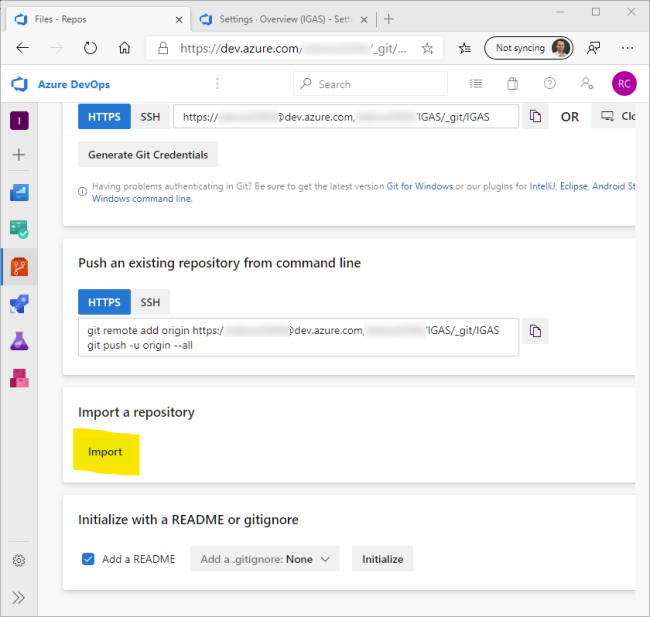

# Exercise #2, Push to Azure App Service (30 min.)
Now that you have completed development of the API, it is time to #RubDevOpsOnIt.
Make sure you have completed the prerequisites so you have an Azure DevOps organization ready to go, then:

1. Log into your DevOps account.
1. Create project
  * Name the project whatever you want.
  * Choose between public and private. It may be easier to receive assistance if you make it public. 
  * Click "Create project" to generate a project backed by a Git repository.

 | Step 1 | Step 2 | Step 3 | 
 | --- | --- | --- 
 |  |  | 
 | --- | --- | --- 
 |  |  | 
 | --- | --- | --- 