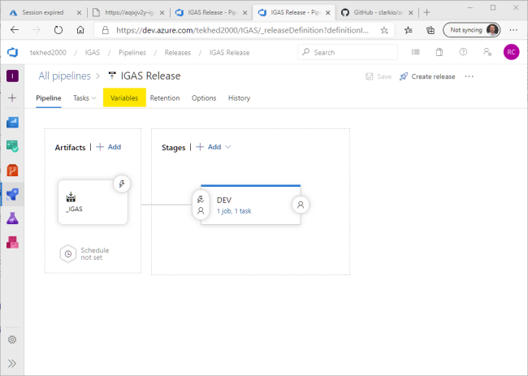
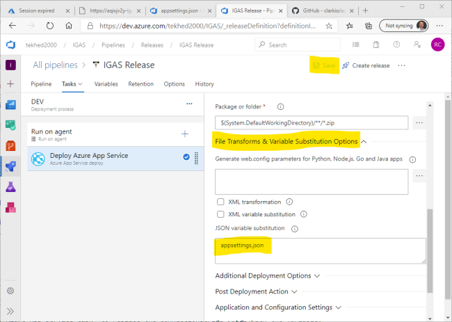
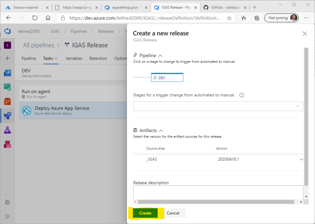
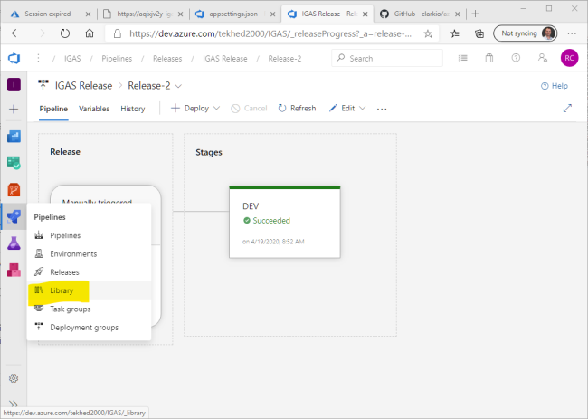
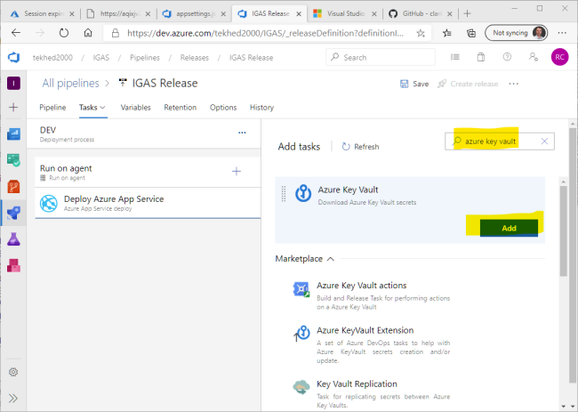
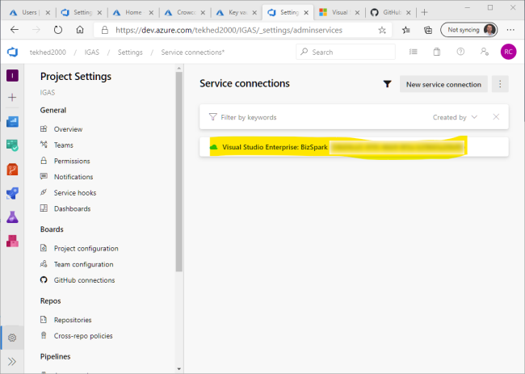
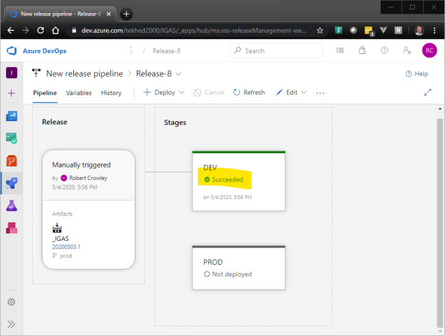
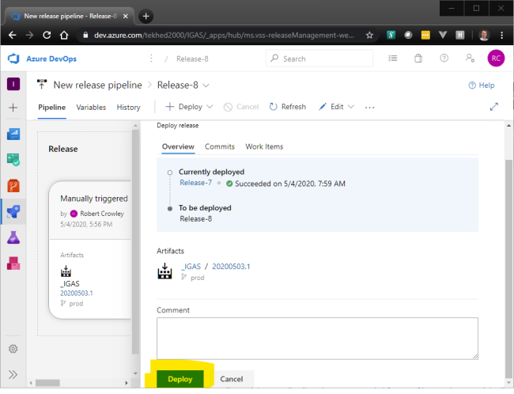

# Exercise 3 - Configuration in Azure DevOps Release Pipelines (40 min)

Very often we have multiple environments that our applications need to be deployed to. In this workshop we will have two - "DEV" and "Production". For simplicity we have left out other, traditional environments like QA and UAT, but the following concepts apply exactly the same.

We only want a single code base so that is why we have application configuration. Dev configuration values need to be different from Production configuration values. We are going to experiment with JSON file value replacement. During the execution of a release, we will substitute placeholder values in json files with environment-specific values. We will do this via 3 methods:
1. Pipeline variables
1. Variable groups
1. Azure KeyVault values

You may recall from a previous exercise that we have 3 appsettings.json settings that have no value: *ConnectionString*, *Password* and *StockQuoteAPIURL*. The values for these settings will be set during the Release.

Let's get the creation of our KeyVault out of the way. You will incorporate this KeyVault into the DevOps Release pipeline in a moment. 
A KeyVault is an Azure service that securely stores keys, secrets and certificates. In this workshop, we will only work with *secrets*. An Azure release pipeline has the capability to read from a KeyVault, making it a great choice for storing secrets.

You will need the ObjectId of your Azure Active Directory account. Following is how to find it with PowerShell. You can also find this in the Azure Portal from Azure Active Directory. If you don't know how to find it, view [this gif](../content/img/get_ad_object_id.gif).

Run this command with a search string that contains part or all of your name as it appears in Azure Active Directory. Copy the value of `Id`:
````Powershell
    Get-AzAdUser -SearchString 'bob'
````
Output:
````
    UserPrincipalName : tekhed_2000_hotmail.com#EXT#@tekhed2000hotmail.onmicrosoft.com
    ObjectType        : User
    DisplayName       : Bob Crowley
    Id                : xxxxxxxx-xxxx-xxxx-xxxx-xxxxxxxxxxxx
````
Once you have the `Id`, paste it into the `ObjectId` below where you see: `xxxxxxxx-xxxx-xxxx-xxxx-xxxxxxxxxxxx`. These commands create a new KeyVault, give you an Access Policy to it, and create one secret within it. You may receive warnings during the execution of this script but it should still complete successfully.

````Powershell
    # Create a KeyVault

    # Once again we need to make an Azure-unique name so we will randomize it.
    $rndName = [System.IO.Path]::GetFileNameWithoutExtension([System.IO.Path]::GetRandomFileName())

    $kv = New-AzKeyVault -Name "kv-$rndName-igas-01" -ResourceGroupName "rg-igas-01" -Location "East US" 

    # Give yourself full access to the keyvault
    Set-AzKeyVaultAccessPolicy `
        -VaultName $kv.VaultName `
        -ObjectId "xxxxxxxx-xxxx-xxxx-xxxx-xxxxxxxxxxxx" `
        -PermissionsToSecrets get, list, set, delete, backup, restore, recover, purge
    
    # Add a secret
    $passwordAsSecureString = ConvertTo-SecureString -String "P@ssw0rd1" -AsPlainText -Force
    Set-AzKeyVaultSecret -Name "Password" -VaultName $kv.VaultName -SecretValue $passwordAsSecureString
````
#### Observe the results of the script
To visualize what you have just done, locate your new KeyVault in the Azure Portal and drill into secret to view it's value. You will notice that secrets are *versioned*. This workshop does not cover versioning but I encourage you to research this and more about KeyVault.


#### Pipeline Variables

> OBJECTIVE: Learn how to create and consume pipeline variables.

We have some more work to do in our Release pipeline. Perform these steps to create a pipeline variable that will be used to supply the value for the `ConnectionString` setting that is currently in our *appsettings.json* file.


Go To Releases


Locate the release you created, select it, and click "Edit"


Click Variables




Click +Add and enter "ConnectionString". It is important that the text exactly match the json setting name. Give it a value, it does not have to be a valid connection string for this demo


Save the pipeline changes


 Next we need to edit the "Deploy Azure App Service task" to replace the ConnectionString value with the variable.
 Select the "Deploy Azure App Service" task, expand "File Transforms & Variable Substitution Options" and enter "appsettings.json" in the JSON variable substitution field.

 This will cause the pipeline to look for JSON fields in appsettings.json that have the same name as any defined variables and replace the value with the variable value.

 

 #### Deploy the pipeline

> OBJECTIVE: Observe how the next deployment will replace the json setting with a pipeline variable.

 Now let's deploy the application again and observe the results. But first, you may want to make a GET request to your application to refresh your memory of what is returned for "ConnectionString". At this time it should be empty.


Click "Create release"


Click "Create"




Click the link to the in-flight deployment


Wait


Success


 Now when you make a GET request to `/Configuration` or `/Configuration/all` you should see the value of the pipeline variable in `ConnectionString`.

 

 #### Variable Groups

>OBJECTIVE: Centralize variables in DevOps with Variable Groups

 You've just seen how to set a pipeline variable, but what if that connection string is commonly used by many of your applications? To avoid entering it into multiple pipelines, and updating multiple pipelines if it ever changes, you can create a Variable Group that is globally available. You then link it to your Release and its values will be available just the same as if you set a variable in the Release pipeline itself.


Hover over the Rocket Ship and select "Libraries".




Click on "+Variable group".


Enter a name for the group. +Add a variable name "StockQuoteAPIURL" and give it a value. Be sure the variable name matches exactly the same entry in your appsettings.json file. Make sure "Allow access to all pipelines" is enabled. I'll leave linking to a KeyVault as extra credit. We will work with your KeyVault soon. Click "Save".


Now that you have a Variable Group, we have to tell our pipeline to use it. Go to Releases.


Find your Release and click "Edit".


Select "Variables".


Click Variable Groups and choose "Link variable group".


Select the Variable Group you created and click "Link".


Save your changes and then create a new release.


Accept the defaults and click "Create".


Navigate to your in-flight deployment


Wait for the deployment to succeed.


Make a GET request to `/Configuration` or `/Configuration/all`. Observe the StockQuoteAPIURL value was replaced by the variable group variable.

 #### Wire in a KeyVault Secret
 
 > Objective: Learn how to connect an Azure KeyVault to a pipeline and consume its secrets.

There are various reasons why you may want to pull values from a KeyVault. The most compelling, in my opinion, is that the value can be hidden even from developers and Ops personnel that maintain the pipelines. To truly hide the value there are additional access restrictions that need to be employed on the App Service, but it is a feasible solution if there are company secrets that are only trusted with a select group of individuals. 
> It is also possible to hide values and restrict access by [encrypting them directly in the pipeline variables](./img/encrypt_var.png)

To accomplish this, we will add a new Task to our Release pipeline that currently has only one Task. We will add a KeyVault task that, similiar to Variable Groups, pulls KeyVault secrets into the pipeline and makes them available for use.


Begin editing the IGAS Release. Click "+" to add a task to the pipeline.


Search for "azure key vault". **Make sure the one you find looks like the screenshot**. Click "Add".




Configure the display name as desired, select the Azure subscription you are working with, choose the correct KeyVault and "Save"


Now drag the KeyVault step above the Deploy step so it runs first. Then "Save".


At this point, the Release pipeline is configure to attempt to pull KeyVault values, but it currently has no access to do so. Click the gear icon and select "Service connections". A service connection is much like a user account in Azure Active Directory, except it is an application identity instead of a user identity. It was created automatically when you "Authorized" the Azure connection during the creation of the Release pipeline.


Click on the service account shown. If you have more than one, you will have to be sure to choose the correct one.




We need some details to be able to find the account in Azure AD. Click "Manage Service Principal".


Click the hyperlink under "Managed application in local directory".


Copy the Object ID of the service principle being used by DevOps.


Execute this command to create an Access Policy on the KeyVault, allowing the DevOps service principal read access to secrets. Replace the `ObjectId` with the value you copied from the Azure Portal. If you lost your terminal session since creating the KeyVault you will need to put the name of your KeyVault in place of `$kv.VaultName`.
    
 ````Powershell
 # Define an Access Policy for the DevOps Service Principal
 Set-AzKeyVaultAccessPolicy `
     -VaultName $kv.VaultName `
     -ObjectId "xxxxxxxx-xxxx-xxxx-xxxx-xxxxxxxxxxxx" `
     -PermissionsToSecrets get, list
 ````


Create a release and deploy the application. Steps to create the release omitted this time, refer to previous examples if necessary.


Make a GET request to `/Configuration` or `/Configuration/all` to observe the KeyVault secret value has been pulled into configuration.


#### DEV vs Production

> OBJECTIVE: Learn how to set stage-specific variables.

The work we have done in exercise #3 is interesting, but where pipeline variables really shine is when you have multiple stages; in our case, DEV and PROD. We will want DEV and PROD to have different connection strings because we don't want to test against production data. 

So lets add a PROD stage to the Deployment and configure a different connection string.


Begin editing the Release. Hover the mouse under the DEV stage until "Clone" appears and then click it.


 An identical copy of the DEV stage appears.


Click the link "1 job, 2 tasks" to edit the new stage.


Change the name of the stage to "PROD".

Click Save.

Click Variables.


On the Variable tab, change the current ConnectionString variable scope to DEV. Then, add a new variable with the same name. Give it a different value so we can see it change, and finally set its scope to PROD. When a Release runs, the variable will have one value during the DEV stage and another during the PROD stage. In this way we can assign correct configuration to particular environments.


Create a Release.


Click the PROD stage to change it to a manual deploy. Currently, the pipeline is configured to deploy DEV and then PROD automatically. By changing the PROD stage to manual we will have a chance to observe how the ConnectionString changes.


Click the link to view the Release in progress.


Wait for the DEV stage to complete.




Make a request to your API. Observe the ConnectionString is returning the DEV value.


Now go back and deploy the PROD stage.


Click Deploy again.




Wait for the Deployment to succeed.


Make another request to your API. Observe the ConnectionString is returning the production value.


#### Summary
You have learned 3 techniques for supplying application configuration from within an Azure DevOps Release Pipeline. You used pipeline variables, variable groups and a KeyVault task. All three rely on the JSON variable substitution setting of the Deploy task to replace values in the chosen json file with variables obtained from the pipeline.

These are not your only options. Feel free to experiment with "Configuration Settings" within the Deploy task's "Application and Configuration Settings" section. Also, there is a marketplace extention named [Replace Tokens](https://marketplace.visualstudio.com/items?itemName=qetza.replacetokens) that works well for replacing tokens in arbitrary files. 

In [exercise 4](exercise_4.md) we will move out of DevOps and into the Azure portal to explore App Service Application Settings and Slots
