# Exercise 4 - Configuration in the Azure Portal (30 min.)

At this point you have seen a variety of ways to configure settings in code and in Azure DevOps. It is time to turn our attention to Application settings in the Azure Portal.

Let's dig right in and set a configuration value.

> OBJECTIVE: Learn to add configuration settings to an App Service in the Azure portal.


From Home in the Azure portal select App Services.


Click the App Service you have been working with.


Open the Configuration blade.


Click "+ New application setting".


Enter a name and value. Here I'm setting a fictitious maximum time to live with a value of 30. Click OK.

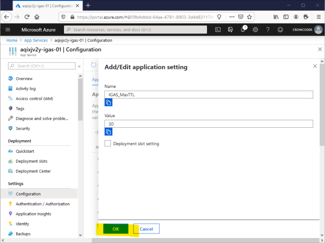


Be sure to Save.


Click "Continue" to save changes and restart your App Service.


Wait for it to complete.


Make a GET request to `/Configuration/all`. You should see the new setting under the Environment Variables Configuration Provider. 


 That was very quick and easy. Let's step back and consider what we did.
 We added configuration to our application without any code changes and without even performing a deployment. The new setting appeared under the Environment Variables, which as we know, is configured for use in our application's program.cs file. This is a very powerful capability. This behavior is what allows us to use appsettings.Development.json or User Secrets, etc., during development but still provide the necessary configuration to production through environment variables. All of the settings you see in the Configuration blade of the App Service become environment variables.

 > **Environment variable caveat**: While environment vars are convenient and easy to use, you must be sure to trust any libraries you use or software you run, especially if you have sensitive values in environment variables. This is because they are accessible to anything. Azure App Services are generally safer for environment variable use than using your own web server, but you should still be sure to trust any third party libraries your code is using.

 You can see many details of your App Service's operating system at the Service Control Management URL, which is the normal URL, except with "scm" appended to the host. For instance, if your application is at:

    https://aqixjv2y-igas-01.azurewebsites.net
Then the SCM URL is here:

    https://aqixjv2y-igas-01.scm.azurewebsites.net

> OBJECTIVE: View the environment variables for your App Service and locate your new Application Setting.


Navigate your browser to your App Service's SCM endpoint and click "Environment"


Click "Environment variables".


Locate the "IGAS_MaxTTL" configuration setting.


#### More fun with KeyVault

> OBJECTIVE: Learn to use a KeyVault secret reference in Azure App Service configuration.

One of my favorite features of App Services is how easy and yet secure it is to pull KeyVault secrets into configuration. Lets do this now. 


Run the following Powershell commands to create another KeyVault secret.

```Powershell
# Create another KeyVault secret
    $bankVaultCombination = ConvertTo-SecureString -String "10-31-15-3" -AsPlainText -Force
    $secret = Set-AzKeyVaultSecret `
        -Name "BankVaultCombination" `
        -VaultName $kv.VaultName `
        -SecretValue $bankVaultCombination
```


Next, your App Service must be granted access to the KeyVault. You will recall creating an access policy for the Azure DevOps service connection. We will do basically the same thing now, except instead of a DevOps service connection, we are granting access to the App Service itself. To make this happen we will enable a very powerful feature called Managed Identity. Managed Identities allow azure resources to have an identity, much like a user, and makes accessing secure resources easier and prevents storing secrets in code. 

```Powershell
# Enable Managed Identity for Azure Resources    
# Don't forget to change $appname to match yours
    $appname = "PUT YOUR APP SERVICE NAME HERE!"
    Set-AzWebApp -AssignIdentity $true -Name $appname -ResourceGroupName $groupName 
    
# Create Access Policy for Managed Identity
    $svcPrincipal = Get-AzADServicePrincipal -DisplayName $appname
    Set-AzKeyVaultAccessPolicy -VaultName $kv.VaultName -ObjectId $svcPrincipal.Id -PermissionsToSecrets get, list 
```
Now we have configured our App Service to have read access to our KeyVault's secrets. We can pull a secret into Configuration with a special syntax call a KeyVault reference. This syntax is a special instruction to the App Service that tells it go look up a secret value and pull that into Configuration, and thus Environment Variables.


You will need to know the secret id, so navigate to your KeyVault and select the Secrets blade.


Open the BankVaultCombination secret.


Continue drilling into the secret details by clicking the CURRENT VERSION.


Copy the Secret Identifier.


Go back to your App Service, Configuration blade and begin adding a new application setting.


For the name, enter "IGAS_BankVaultCombo". For the Value, enter: "@Microsoft.KeyVault(SecretUri= \<the Secret Identifier>)". Mine looks like this: *@Microsoft.KeyVault(SecretUri=https://kv-vi53gndb-igas-01.vault.azure.net/secrets/BankVaultCombination/d18bc738075e4c8ca24a346dc1fe8150)*. Click OK.


Be sure to Save.


If you did everything correctly, you will see a green checkmark indicating the KeyVault reference has been successfully resolved, though it may take a moment.


1. Make a GET request to `/Configuration/all` and observe the value coming from a KeyVault secret.


#### Slot Settings

> OBJECTIVE: Learn what slot deployments are and how to use them. Configure settings such that they either stick to a slot, or apply to all slots.

The last bit of magic we will do in the Azure Portal is to enable slots for our application and provide slot-specific configuration. 
> [**Slots Documentation**](https://docs.microsoft.com/en-us/azure/app-service/deploy-staging-slots)

Slots used to be called "testing in production". While I prefer the term "slots", the old name is admittedly descriptive. It allows you to deploy your application to the production App Service, *but on a differt URL*. Testing can be done at this staging URL, and when everything looks good, you perform a simple "swap" and what you just deployed to the test/staging slot is now full production. This is a great feature. If you currently do production deployments directly to production you know that as soon as you pull that trigger it either works or it doesn't. This can lead to chaos if it doesn't. With slots, if it doesn't work in the staged slot then you just do not perform the swap. You fix the issue, re-deploy to the staging slot, and test again. If a bug is found after a swap, you can swap again to roll back.

Let's enable slots for our application and tweak some configuration.


Open the Deployment Slots blade of your Azure App Service in the Azure portal and click "Add Slot".


Give it a name, "Staging" being a good choice. **Be sure to clone settings from the existing App Service**. Click "Add", and then "Close".


Click your new slot to see its Overview.


Note its URL is different than your "production" app service. However, there is no application there yet. Creating a slot does not carry over any deployed application so we must do a deployment to the slot before we can use the staging environment.

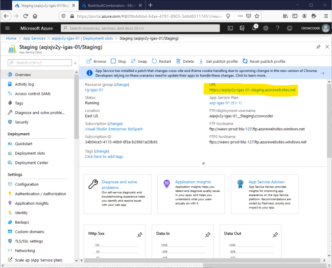


Now navigate over to DevOps and begin editing the Release pipeline's PROD stage. Select the "Deploy Azure App Service" task. Edit this task to deploy to the slot we just created. Your Resource Group and Slot selections should be available in the drop down lists. Be sure to Save your changes.


Now create a Release and Deploy both the DEV and PROD stages.


Make a GET request to the staging URL and observe that the deployment succeeded.

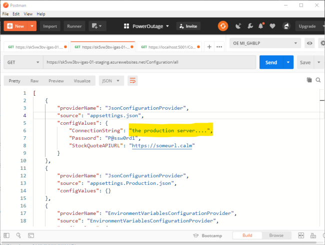


Make a GET request to the production URL and observe it is still online.


Now we have two active slots. In a testing scenario, you can direct your testers to the staging slot without affecting production operations (with the caveat that resources such as databases, etc., might still be the same depending on your needs).

Let's explore configuration settings and how they behave in slot deployments. We will use the `MaxTTL` configuration setting to observe it either changing or not changing between the slots, depending on how it is defined.

### Deployment Slot Settings

> OBJECTIVE: Observe how *non-slot* settings move along with the application during a swap.


Access the Configuration blade of the production slot. Click on `IGAS_MaxTTL` to open its properties.

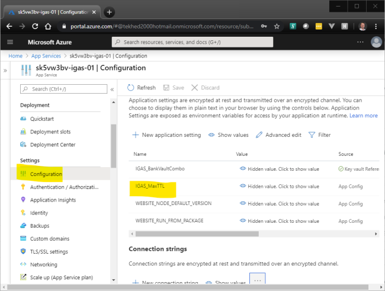


Make note of its value and that it is **NOT** designated a "Deployment slot setting". Click OK or Cancel to exit without changes.

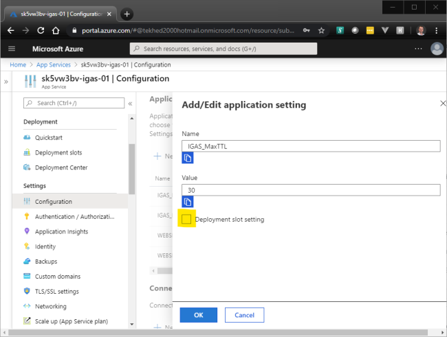


1. Now look at the staging slot configuration. Open the "Deployment slots" blade and click on the staging slot link.

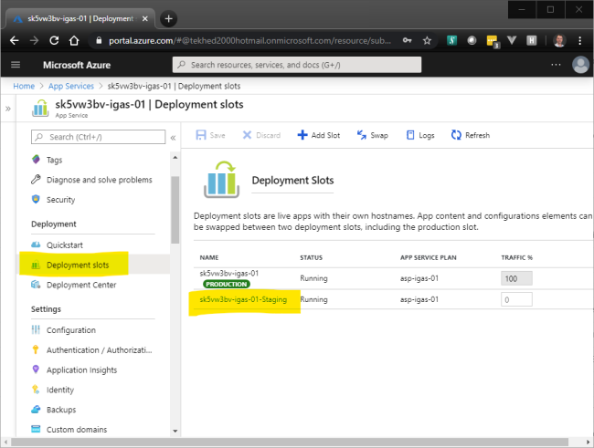


Open the staging slot's Configuration blade. Open the `IGAS_MaxTTL` setting.

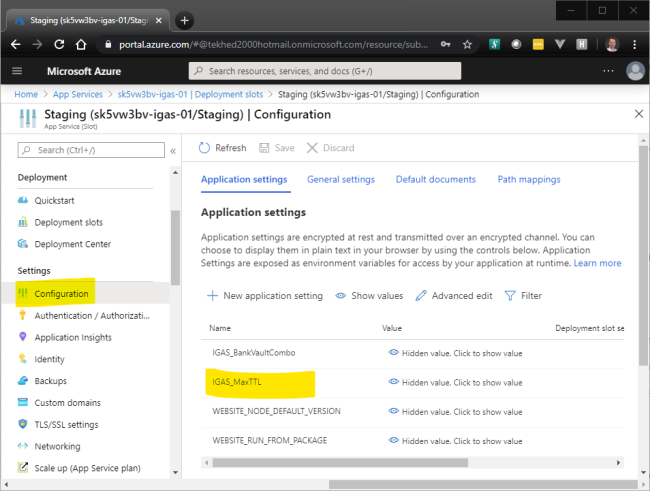


Change its value to something other than 30.

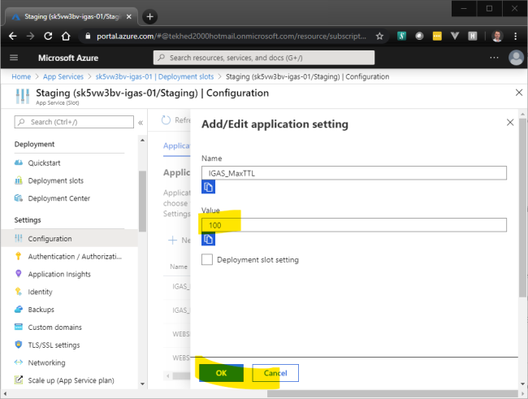


Save.

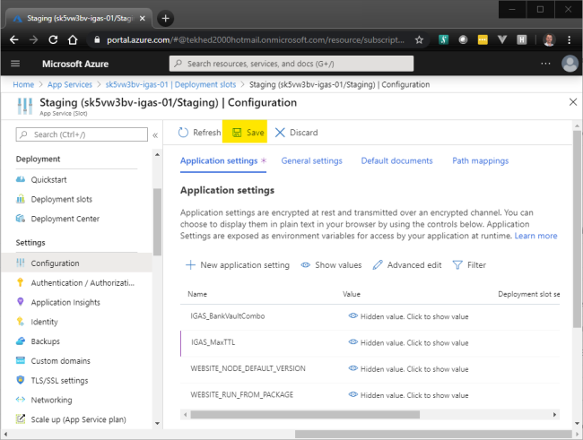


Make a request to the staging URL. Note its value is what you just changed it to in the Azure portal.

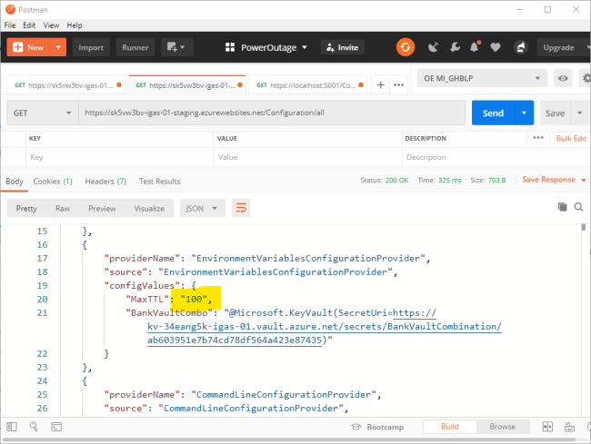


Make a request to the production URL. Note its value has not changed.

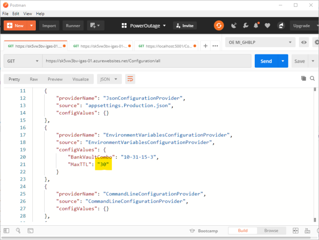


Now lets swap slots. We should see the values swap because the setting was not designated a Deployment slot setting. The values are part of the application and they move with the application. Go to the Overview blade of either the staging or production slot and click "Swap".

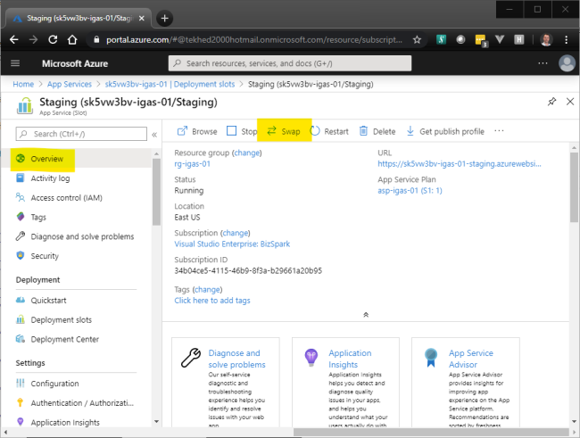


Make note of the Old and New values for the target slots, then click "Swap".

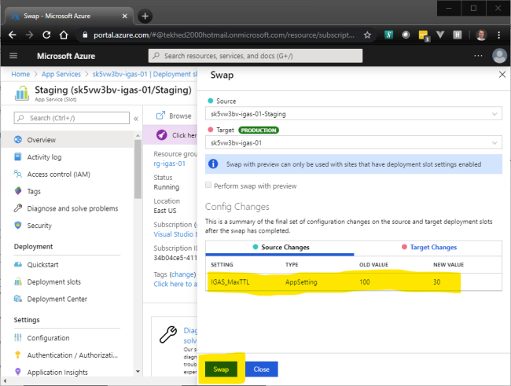


After a few moments you should receive a success message. Click "Close".

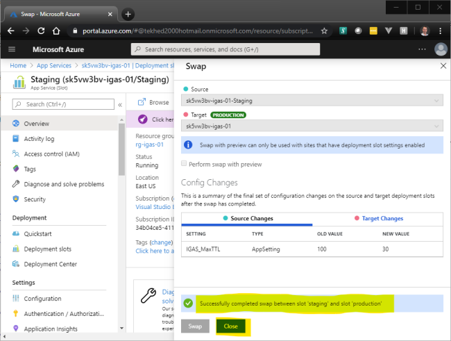


Make a request to the staging slot and note the `MaxTTL` setting is back to 30.

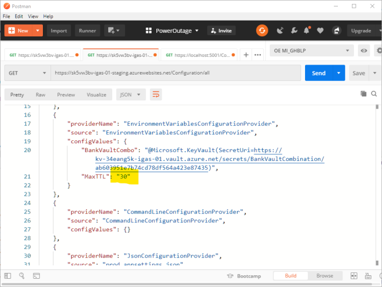


Make a request to the production slot and note the `MaxTTL` setting is also changed.

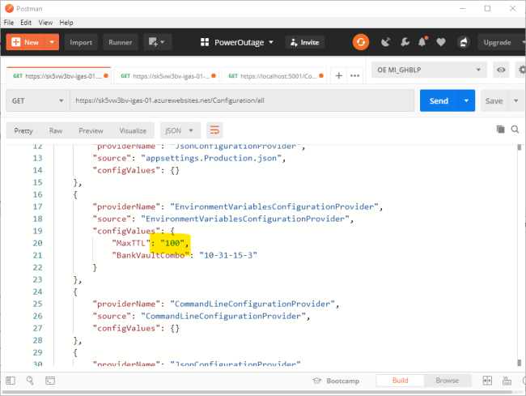

> OBJECTIVE: Observe how Deployment slot settings do not move along with a swap. The settings are effectively part of the slot, not the application.


Open the Configuration blade of either the staging or production slot and click on the MaxTTL setting to open its properties.

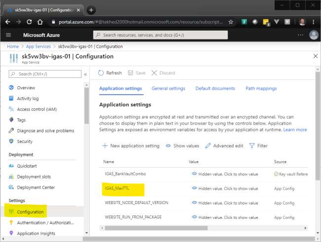


This time, check "Deployment slot setting". Click OK.

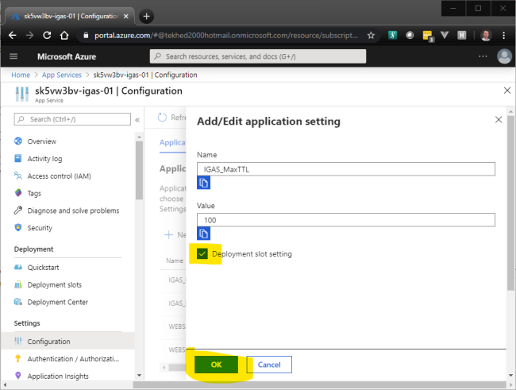


Click Save, and then Continue to save the change and restart the App Service.

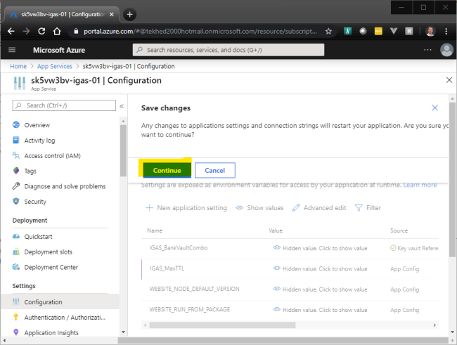


Perform a GET request to both URLs. You should observe no changes yet. 

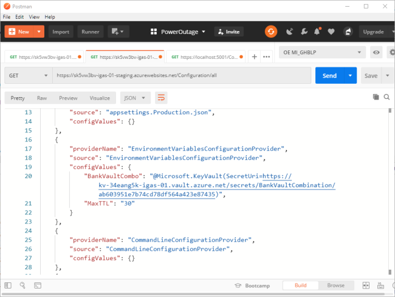


Now, repeat steps 9 through 13 from the previous objective. Except this time, observe that the settings have not changed! The settings stuck to the slot itself, instead of traveling with the application.