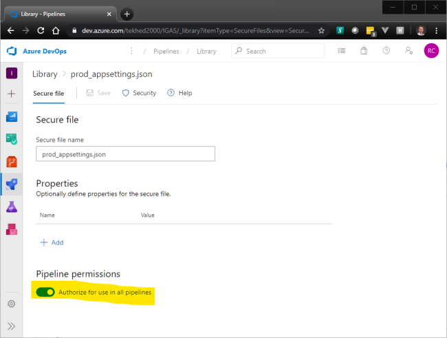
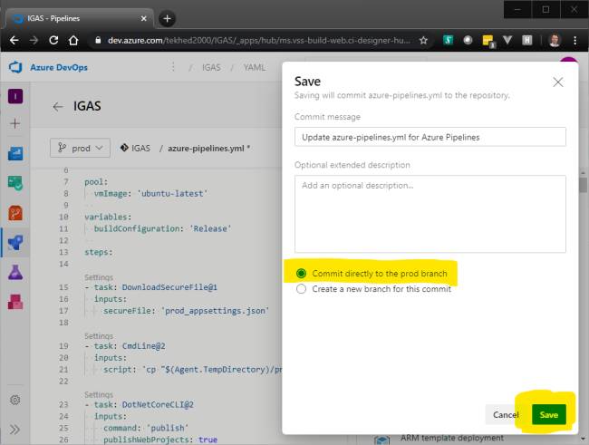
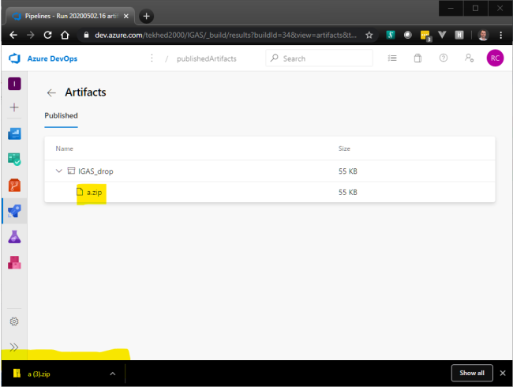
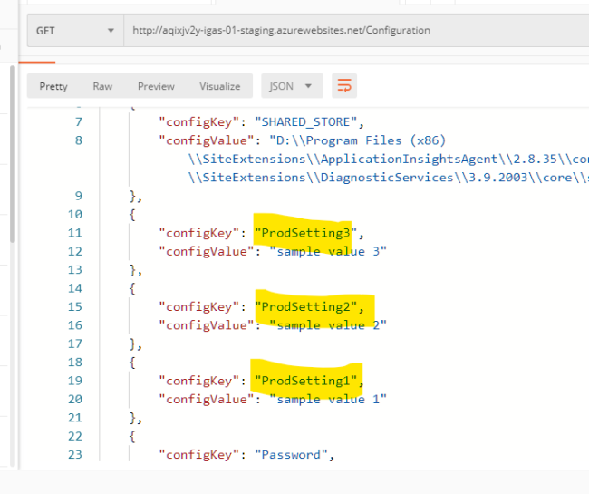

# Exercise 5 - Secure Files (30 min)

Exercise 3 introduced you to Variable Groups which are variables stored globally within the DevOps Library. Another feature of the Library is Secure Files, which allow you to securely store arbitrary files. They cannot be downloaded directly nor viewed, they are only available to pipelines and they are deleted from the pipeline temporary folder immediately after use. The primary purpose is to store [signing certificates, Apple Provisioning Profiles, Android Keystore files, and SSH keys](https://docs.microsoft.com/en-us/azure/devops/pipelines/library/secure-files?view=azure-devops), but they can also be extremely handy for storing configuration secrets needed by your applications.

The basic idea is to store a json file containing configuration settings in the DevOps Library and copy it into your publish folder during a Build. If, in the start up of your .NET Core application you do an Add() of a json file by the same name as your secure file, your application will pull the settings into Configuration the same as if you put your settings into appsettings.json or any other provider.

You may have noticed that in [program.cs](/Program.cs) there is a line of code that adds a json file named "prod_appsettings.json" to Configuration. This was designated optional but now we are going to make use of it.

#### Extend the Build to Bring in prod_appsettings.json
We need to add two steps to the Build pipeline. First it will download the secure file, then a Command Line task will copy it into the staging directory so that it gets pulled into the artifact that is deployed by the Release.

1. With any text editor, create a json file with a few settings. Paste the following if you like:
    ````json
    {
        "ProdSetting1" : "sample value 1",
        "ProdSetting2" : "sample value 2",
        "ProdSetting3" : "sample value 3"
    }
    ````
1. Now go to DevOps, access the Library by clicking the Rocket Ship, select Library, then click Secure Files.
1. Upload a Secure File.
1. Confirm
1. Click on your secure file to access its properties.
1. Slide the toggle to Authorize for use in all Pipelines. The mores secure option is to leave this disabled but if you do, you will need to perform an "allow" step before the build will continue.
1. Go to Pipelines.
1. Begin an edit on the IGAS pipeline.
1. **Switch the branch to "Prod"** if not already selected. Then edit the azure-pipelines.yml file by un-commenting the following lines. Yaml is whitespace sensitive, so be careful to delete only the "#" characters. Save your changes.
    ````yaml
    #- task: DownloadSecureFile@1
    #  inputs:
    #    secureFile: 'prod_appsettings.json'
    #
    #- task: CmdLine@2
    #  inputs:
    #    script: 'cp "$(Agent.TempDirectory)/prod_appsettings.json" "$(Build.ArtifactStagingDirectory)"'
    ````
1. Choose to commit the change directly to the prod branch. 
1. A build will begin automatically.
1. Click on the executing build and wait for it to complete.
1. Click on the artifact.
1. Drill into the artifact to locate the .zip file and download it by clicking on it.
1. Open the zip file and notice the secure file is part of the package.
1. Finally, make a request to your API and observe the settings from the secure file are displaying.

Finally, create a new release, deploy it and observe the settings from the Secure File are included.

 | Step 1 | Step 2 | Step 3 | 
 | --- | --- | --- |
|  |  |  |
 | **Step 4** | **Step 5** | **Step 6** | 
|  |  |  |
 | **Step 7** | **Step 8** | **Step 9** | 
|  |  |  |
 | **Step 10** | **Step 11** | **Step 12** | 
|  |  |  |
 | **Step 13** | **Step 14** | **Step 15** | 
|  |  |  |
 | **Step 16** | | | 
|  | | |


